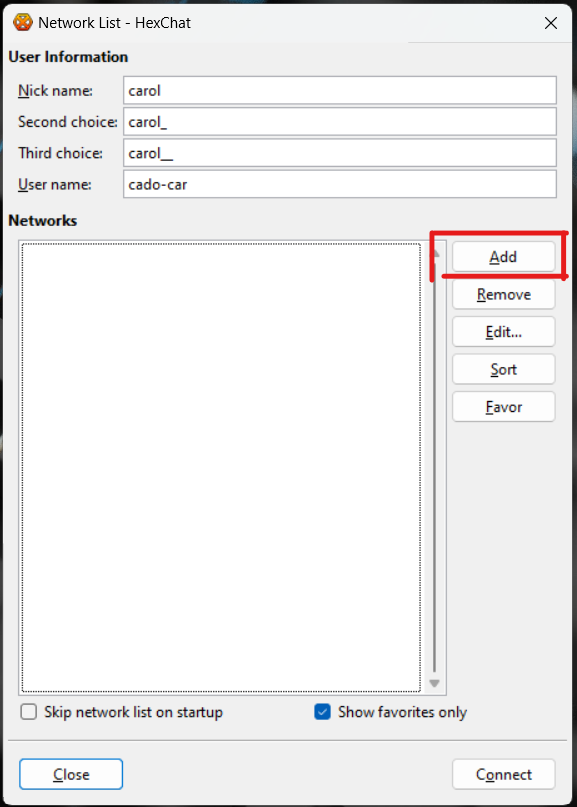
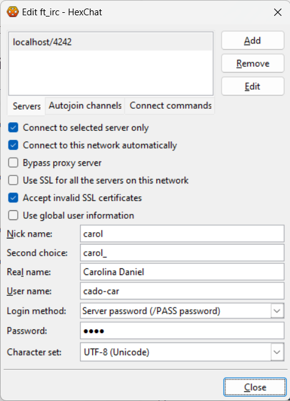
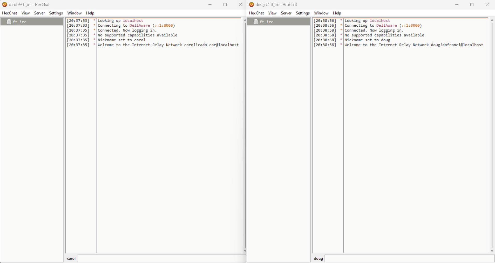
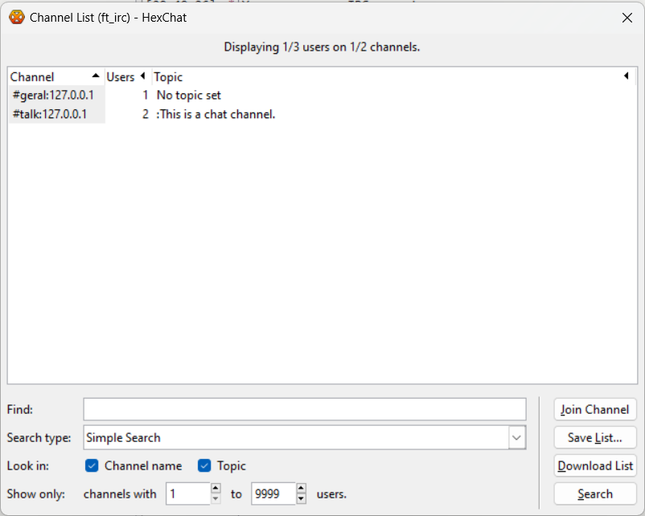
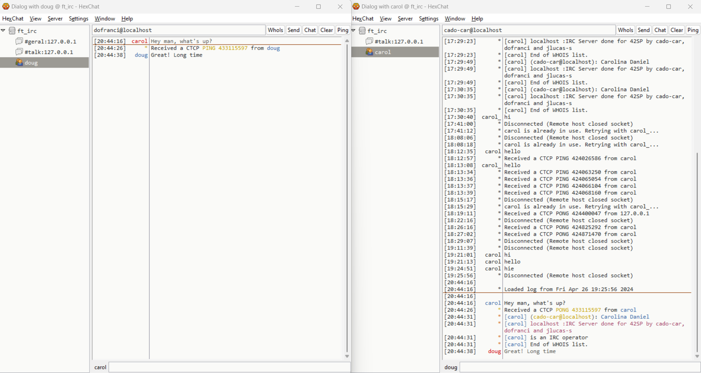
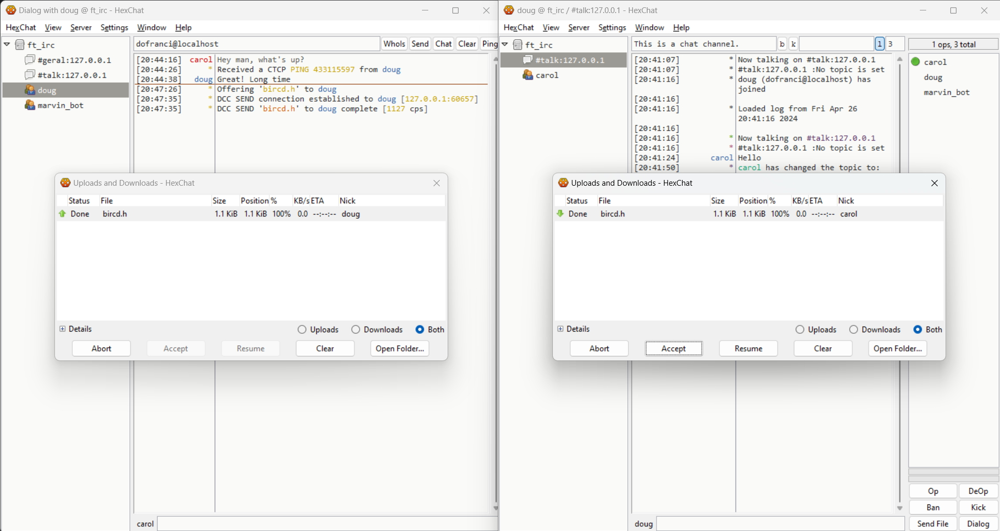
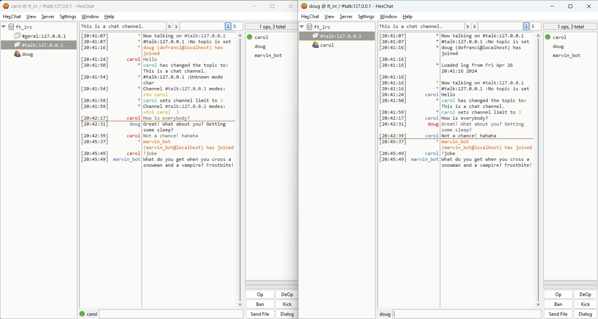
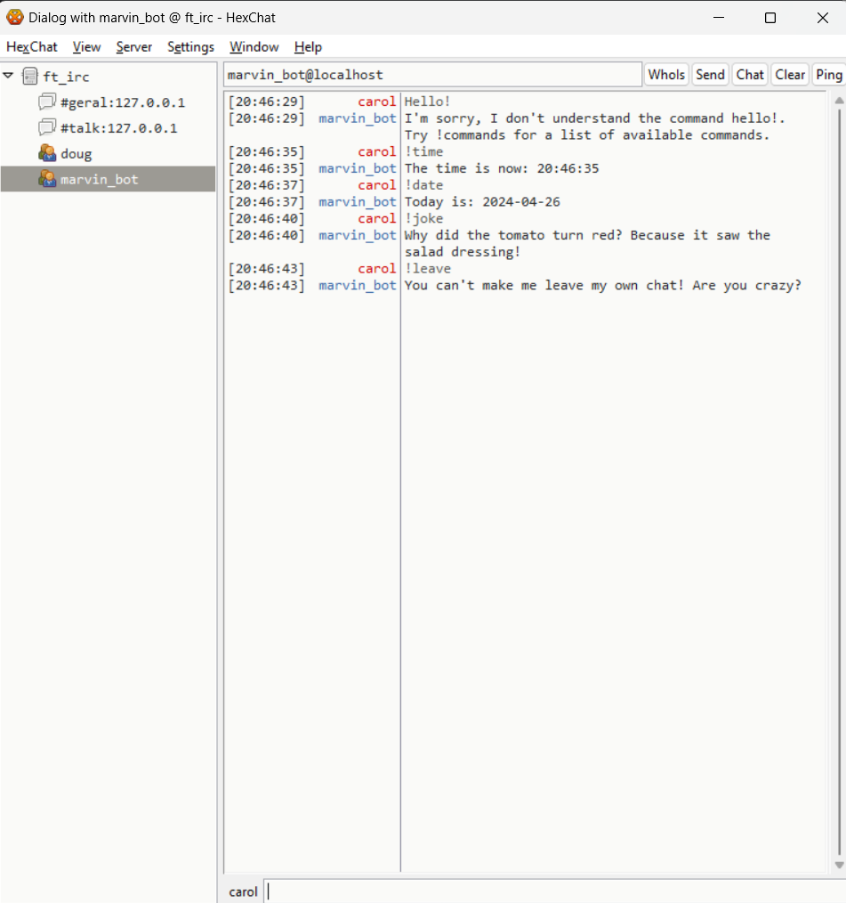

<h1 align=center>
	<b>ft_irc</b>
</h1>

<h2 align=center>
	 <i>42cursus' project #13</i>
</h2>

<p align=center>
	This is the second last project of the 42cursus' common core. The goal of this project is to create an IRC server in C++98. Now, we should be able to study protocols, open sockets, and handle multiple connections at the same time. This project is a great opportunity to learn about network programming and to understand how servers and clients communicate with each other. Does it sound simple? Well, it's not. But, for me at least, was a lot of fun.


---
<div align=center>
<h2>
	Final score
</h2>

<h4>Completed + Bonus</h4>

</div>

---

<h3 align=center>
Mandatory
</h3>

> <i> For the <b>mandatory</b> part, you must follow these rules: </i>
> - You must implement an IRC server in C++98;
> - You mustn't develop a client, but must choose an existing one as reference;
> - You mustn't handle server-server communication;
> - The server must be able to handle several clients at the same time, and all communication must be done via TCP/IP (v4 or v6);
> - Forking is not allowed;
> - All I/O operations must be non-blocking;
> - Only 1 poll() is allowed;
> - You must be able to authenticate, set a nickname, a username, join a channel, send and receive private messages;
> - You must handle the following commands: KICK, INVITE, TOPIC, MODE (with i, t, k, o and l parameters);


<h3 align=center>
Bonus
</h3>

> <i> For the <b>bonus</b> part, you must follow these rules: </i>
> - Handle file transfers;
> - A bot;

---

<h2>
The project
</h2>

So, like in every single project so far, the real question here is: where do we start? 

I think a good way to approach this project is to try and understand everything we can about servers and clients. How to connect them, how to make them interact with each other and, most importantly, what types of "rules" these connections follow - also known as protocols.

### What is a server?

In simple terms, a **server** is a computer program or a device that provides any sort of service to other programs or devices, known as **clients**. These services can be anything from sharing data or resources to performing computations for the client. APIs, for example, are a type of server that provides a set of rules for how software programs can interact with each other. Databases are also servers, as they provide a service to store and retrieve data.

One important thing to have in mind is that servers are not necessarily on the same machine as the client. They can be located anywhere in the world, as long as they have ways to establish a connection with the client.

### How to connect a client to a server?

The most common way to connect a client to a server is through the **TCP/IP** protocol. This particular protocol is the most widely used protocol in the world, and it governs how data is sent and received over the internet. 

It's not for us, in this project, to understand in depth how TCP/IP works. However, it is important to understand what protocols are, and how they work. 

### What is a protocol?

A **protocol** is a set of rules that govern how data is transmitted between devices in a network. It's like a language that is used to allow communication. In order to establish a connection, both the client and the server must speak the same language. 

Protocols are conventions. Most of them, today, are standardized, which means that they are widely accepted and used. We can find protocols for almost everything, from how to send an email to how to connect to a server. 

### What is RFC?

The **Request for Comments** (RFC) documents are a series (with thousands of entries) of documents that describe the protocols, technologies, and policies used in the internet. They are the result of the work of the Internet Engineering Task Force (IETF), and they are the standardization documents of the internet.

All (or almost all) protocols used in the internet are described in RFC documents. They are, for lack of a better word, the "bible" of the internet.

So, that means that if you want (and you do want) to create a server from scratch - and in our case, an IRC server, then you should probably start by reading the RFC documents that describe the IRC protocol. To be more precise, the **RFC 1459** and the **RFC 2810 to 2813**.

Again, it's not for us to understand in depth how these protocols work. But it's important to understand that they exist, and that they are the rules that we must follow in order to create our IRC server (especially because we are going to be able to connect to a real IRC client in the process).

### What is an IRC server?

But after all, what in the world is an IRC server?

The **Internet Relay Chat** (IRC) is a protocol that allows users to communicate with each other in real-time. It's a text-based protocol, and it's been around since 1988. It's one of the oldest protocols still in use today.

With an IRC server, users must be able to connect to it, and then they can join channels, send private messages, and perform a series of other actions. The server is responsible for handling all these actions, and for sending the messages to the right clients, either in channels, privately, or to the server itself, in order to perform some action.

That's what we are going to develop the logic behind the IRC server's resposes to the clients' actions. How to store the users' information, how to handle the channels, and how to send and receive messages, either in channels or privately.

But first, we must understand how to create a server in C++.

<h2>
Creating a server in C++
</h2>

The first real technical challenge of this project is to create a server in C++. 

For starters, we must be able to connect two programs through a network. This is done through **sockets**.

### What is a socket?

A **socket** is one endpoint of a two-way communication link between two programs running on the network. A socket is bound to a port number so that the TCP layer can identify the application that data is destined to. Sounds complicated? Surprisingly, it's not.

Imagine that a socket is like a telephone. When you want to call someone, you pick up the phone and dial the number. The other person picks up the phone and answers. The connection is established, and you can start talking.

In the same way, when you - a client - want to connect to a server, you create a socket and connect it to the server's address and port. The server accepts the connection, and the connection is established. You can start sending and receiving data.

A socket is the combination of an IP address and a port number. The IP address is the address of the server, and the port number is the "door" that you want to knock on - or the number of the extension that you want to call.

The same way, the client creates a socket and connects it to the server's address and port, the server creates a socket and binds it to a port. When a client connects to the server, the server accepts the connection and creates a new socket to communicate with the client. 

Since we won't be creating a client in this project, we are going to focus on the server's side of the connection. But, either way, we will need to extract the client's address and port in order to send and receive data correctly.

### How to create sockets? 

Regardless of the programming language, creating a socket is a relatively simple process, and it's supported by most operating systems.

In C++, we can create a socket using the **socket()** function, which is part of the **sys/socket.h** library. This function returns a file descriptor that we can use to send and receive data.

This is important to understand: under the hood, a socket is a file descriptor. This means that we can use the same functions that we use to read and write files to send and receive data through a socket. 

When calling the right functions, the operating system takes care of the rest. The kernel will be the one responsible for handling the data that is sent and received through the socket. It's the kernel that sends the data to the network, and it's the kernel that receives the data from the network. Our program only needs to read and write to the correct file descriptor.

In C++, we will need to use the following functions to enable the full capabilities of the socket:

- **`socket()`**: to create the socket; 
- **`bind()`**: to bind the socket to a port;
- **`listen()`**: to listen for incoming connections;
- **`accept()`**: to accept an incoming connection;

Each one of these functions has its own parameters and return values, and we must fully understand how to use them.

#### The `socket()` function

```c++
int socket(int domain, int type, int protocol);
```

The `socket()` function creates a new socket and returns a file descriptor that we can use to send and receive data. 

- The `domain` parameter specifies the protocol family that we want to use. In our case, we are going to use the `AF_INET` protocol family, which is the most common protocol family used in the internet. This protocol family is used with the `IPv4` addresses. If you want to use the `IPv6` protocol family, you should use the `AF_INET6` protocol family. The macros for these protocol families are defined in the `sys/socket.h` library.

- The `type` parameter specifies the type of the socket. We are going to use the `SOCK_STREAM` type, which is a reliable two-way connection-based byte stream. This means that the data is sent and received in the same order that it was sent, and that the data is not lost or duplicated. If you want to use a connectionless datagram service, you should use the `SOCK_DGRAM` type.

- The `protocol` parameter specifies the protocol that we want to use. We are going to use the `0` protocol, which is the default protocol for the given domain and type. If you want to use a specific protocol, you should use the `getprotobyname()` function to get the protocol number.

After calling the `socket()` function, we will have a file descriptor that we can use to send and receive data.

#### The `bind()` function

```c++
int bind(int sockfd, const struct sockaddr *addr, socklen_t addrlen);
```

Now, we need to bind the socket to a port. That's the difference between a regular socket and a server socket. A regular socket is not bound to any port, and it's not listening for incoming connections. A server socket is bound to a port, and it's listening for incoming connections.

In clients, for example, we don't need to bind the socket to a port. We only need to connect the socket to the server's address and port - we usually use the function `connect()` to do that.

In servers, however, we need to bind the socket to a port. That means that the server will be able to listen for incoming connections on that port.

The `bind()` function takes three parameters:

- The `sockfd` parameter is the file descriptor of the socket that we want to bind to a port;

- The `addr` parameter is a pointer to a `sockaddr` structure that contains the address and port that we want to bind the socket to. This structure is a generic structure that can be used with any protocol family. In our case, we are going to use the `sockaddr_in` structure, which is specific to the `AF_INET` protocol family. This structure contains the `sin_family` member, which is the protocol family, the `sin_port` member, which is the port number, and the `sin_addr` member, which is the address. The `sin_addr` member is usually set to `INADDR_ANY`, which means that the socket will be bound to all available interfaces. The `sin_port` member is set to the port number that we want to bind the socket to. Both of these members must be in network byte order, which means that we must use the `htons()` function to convert the port number to network byte order.

- The `addrlen` parameter is the size of the `addr` parameter. This parameter is usually set to `sizeof(struct sockaddr_in)`.

After calling the `bind()` function, the socket will be bound to the specified port. However, it's not yet listening for incoming connections. 

#### The `listen()` function

```c++
int listen(int sockfd, int backlog);
```

Now, we need to listen for incoming connections. That means that the server will be able to accept incoming connections on the specified port.

The `listen()` function takes two parameters:

- The `sockfd` parameter is the file descriptor of the socket that we want to listen for incoming connections;

- The `backlog` parameter is the maximum length of the queue of pending connections. This parameter is usually set to `5`. You can even set it to any value that you want, but most operating systems will silently truncate it to `5`.

After calling the `listen()` function, the socket will be listening for incoming connections. However, it's not yet accepting incoming connections.

#### The `accept()` function

```c++
int accept(int sockfd, struct sockaddr *addr, socklen_t *addrlen);
```

Finally, we need to accept incoming connections. That means that any client that attempts to connect to the server will be able to do so.

The `accept()` function takes three parameters:

- The `sockfd` parameter is the file descriptor of the socket that we want to accept incoming connections;

- The `addr` parameter is a pointer to a `sockaddr` structure that will contain the address and port of the client that is connecting to the server. This structure is a generic structure that can be used with any protocol family. In our case, we are going to use the `sockaddr_in` structure, which is specific to the `AF_INET` protocol family. This structure contains the `sin_family` member, which is the protocol family, the `sin_port` member, which is the port number, and the `sin_addr` member, which is the address. The `sin_port` member is set to the port number of the client that is connecting to the server. The `sin_addr` member is set to the address of the client that is connecting to the server. Both of these members will be in network byte order, which means that we must use the `ntohs()` function to convert the port number to host byte order, and the `inet_ntoa()` function to convert the address to a string. The `addr` parameter can be set to `NULL` if we don't want to know the address and port of the client that is connecting to the server.

- The `addrlen` parameter is the size of the `addr` parameter. This parameter is usually set to `sizeof(struct sockaddr_in)`.

After calling the `accept()` function, we will have a new file descriptor that we can use to send and receive data with the client that is connecting to the server.

### Non-blocking I/O

The next challenge is to make the I/O operations non-blocking. This is important because we want to be able to handle multiple connections at the same time. If we use blocking I/O operations, the program will stop and wait for the data to be sent or received. That means that we will only be able to handle one connection at a time.

We could, theoretically, create a new thread for each connection. However, this is not a good idea. Threads are expensive, and they consume a lot of resources. If we have a lot of connections, we will have a lot of threads, and the program will consume a lot of resources.

The best way to handle multiple connections at the same time is to use non-blocking I/O operations. This means that the program will not stop and wait for the data to be sent or received. Instead, the program will continue to run, and we will be able to handle multiple connections at the same time.

The `accept()` function is a blocking function. That means that the program will stop and wait for a client to connect to the server. 

We can, however, make the `accept()` function non-blocking by using the `fcntl()` function to set the `O_NONBLOCK` flag on the socket. This flag will make the `accept()` function return immediately if there are no pending connections. 


#### The `fcntl()` function

```c++
int fcntl(int fd, int cmd, ... /* arg */ );
```

The `fcntl()` function is used to perform various operations on a file descriptor. It takes three parameters:

- The `fd` parameter is the file descriptor that we want to perform the operation on;

- The `cmd` parameter is the operation that we want to perform. We can use the `F_SETFL` command to set the file status flags. We can use the bitwise OR operator to set the `O_NONBLOCK` flag on the socket.

- The `arg` parameter is the value that we want to set. We can use the `O_NONBLOCK` flag to make the `accept()` function non-blocking.

After calling the `fcntl()` function, the `accept()` function will return immediately if there are no pending connections.

#### The `poll()` function

```c++
int poll(struct pollfd *fds, nfds_t nfds, int timeout);
```

The `poll()` function is a non-blocking function that is used to monitor file descriptors for I/O events. It takes three parameters:

- The `fds` parameter is a pointer to an array of `pollfd` structures. 
	```c++
	struct pollfd {
		int fd;         /* file descriptor */
		short events;   /* requested events */
		short revents;  /* returned events */
	};
	```
	- The `fd` member is the file descriptor that we want to monitor.
	- The `events` member is the events that we want to monitor. There are macros for different events, such as `POLLIN` for data to be read, `POLLOUT` for data to be written, and `POLLERR` for an error condition. We can use the bitwise OR operator to monitor multiple events at the same time.
	- The `revents` member is the events that occurred. This member is set by the kernel, and we can use the bitwise AND operator to check if a specific event occurred.

- The `nfds` parameter is the number of file descriptors that we want to monitor.

- The `timeout` parameter is the maximum amount of time, in milliseconds, that we want to wait for an event to occur. This parameter is usually set to `-1`, which means that we want to wait indefinitely (making it a blocking function all the same). You can even set it to `0`, which means that we don't want to wait at all.

The `poll()` function returns the number of file descriptors that have events that occurred, `0` if no events occurred before the timeout, or `-1` if an error occurred.

### Multiple sockets = multiple clients

The most important thing to understand about servers is this: In order to accept multiple clients, we need to create multiple sockets. Each one of these sockets will be responsible for handling the connection with a single client.

There's one socket - called the **server socket** - that is responsible for listening for incoming connections. When a client connects to the server, the server socket will accept the connection and create a new socket to communicate with the client. 

These other sockets - called **client sockets** - are responsible for handling the connection with the client. They are created by the server socket, and they are used to send and receive data with the client.

This is important to understand: the server socket is not used to send and receive data with the client. It's only used to accept incoming connections. The client sockets are used to send and receive data with the client.

<h2>
The IRC protocol
</h2>

Now, we know how servers and clients communicate with each other. We know how to create a server in C++, and we know how to handle multiple connections at the same time. This, however, is just the very first step.

In order for our server to be considered an IRC server, it must learn how "to speak" the IRC protocol. This is the core of the project, and where the real challenge lies.

The IRC protocol is a text-based protocol. That means that all communication is done through text messages. These messages are sent and received through the sockets, and they follow a specific set of rules.

The IRC protocol is described in the RFC 1459 and the RFC 2810 to 2813. These documents describe the rules that we must follow in order to create an IRC server. We won't need (God forbid!) to implement the entire protocol. That would be a nightmare. But we must implement the most important parts of it.

We also need to choose a client to use as a reference. In our case, we chose to deal with the open-source IRC client `HexChat`. This client is available for Windows, macOS, and Linux, and it's a great reference for us to understand how the IRC protocol works.

It's important to have in mind that, although the RFC documents are an important baseline for stablishing comunication between the server and the client, each client and each server may have their own set of rules and abstractions that are not necessarily described in the RFC documents. 

In our case, our server must ensure the best and most noise-free possible comunication with the client of our choice, but it does not garantee that it will be the case for any other client. During the evaluation process, we must use the client that we chose as a reference to test the server's responses to the client's actions.

So, why `HexChat`? Because it's open-source, and because it's available for all major operating systems. This means that we can use it to test the server's responses to the client's actions, regardless of the operating system that we are using. It's also one of the most popular IRC clients, and it's widely used by the IRC community.

To download `HexChat`, you can visit the official [HexChat website](https://hexchat.github.io/).

### Messages sent and messages received

When a new client connects to the server, the client sends a series of messages to the server who must, in turn, respond appropriately. 

This is the main core of the project: understanding the messages that the client sends to the server, and responding to these messages with the appropriate replies. To do so, you must use as references: 
- the RFC documents that describe the IRC protocol;
- the IRC client that you chose as a reference.

Like we said before, our program must be able to open a socket, bind it to a port, listen for incoming connections, and accept incoming connections. 

Once the connection is established, the client sends a series of messages to the server. These messages follow a very specific format.

So, for starters, let's break down the protocol syntax:

- The messages that the client sends to the server are called **commands**;
- The server must respond to these commands with the appropriate **replies**;

All messages are sent and received through the sockets. The messages are sent as **strings**, and they follow a specific format. The messages are separated by a `\n` and a `\r` character.

The syntax for all **commands** is as follows:

```
:prefix command [parameters] :trailing
```

- The `prefix` is an optional field that contains the address of the client that is sending the message. This field is usually set to the client's nickname, but it can be set to the client's username or hostname. The `prefix` is identified by the `:` character. For example: `:nick!user@host` or `:irc.example.com`;

- The `command` is the command that the client is sending to the server. This field is mandatory, and it must be a valid command. For example: `NICK`, `USER`, `JOIN`, `PRIVMSG`, `QUIT`, `KICK`, `INVITE`, `TOPIC`, `MODE`, `WHOIS`, `WHO`, `LIST`, `NAMES`;

- The `parameters` are the parameters of the command. This field can contain zero or more parameters, depending on the command. The parameters are separated by a space character. For example: `#channel`, `nickname`, `message`;

- The `trailing` is the last parameter of the command, and it's optional. This is important: the trailing is part of the command itself, but it's main difference is that it can contain one or more words, all considered as a single parameter. The `:` character is used to identify the begginning of the `trailing` parameter, and everything that comes after it is considered part of the `trailing`. For example: `:Hello, world!`;

During the parsing of the messages, the server must be able to identify the `prefix`, the `command`, and all the `parameters`, including the `trailing` one.

In the other end, the server must respond to the client's commands in a way that the client will understand. Clients have a set expectations regarding replies formatting, coding and timing. Understand that was one of the most challenging parts of the project, but it was also one of the most rewarding.

The syntax for **replies** can differ depending on the type of command and context. For these project, we were able to identify the following: 

#### Server->Client replies

When the server needs to send a reply directly to a single client, usually involving a command that is **not** in the scope of channels or private users. We send this message on behalf of the server, directly to the client who requested the action.

For example:

```
# Reply to a /USER command
:irc.example.com 001 nick :Welcome to the Internet Relay Network nick!user@host

# Reply to a /LIST command
:irc.example.com 322 nick :#channel 1 :Welcome to the channel

# Reply to a /OPER command
:irc.example.com 381 nick :You are now an IRC operator
```

- The `prefix` is the server's address: `:irc.example.com`;

- The `code` is a three-digit number that identifies the type of reply, either to identify sucess or failure in processing the request. The `001`, for example, is the welcome message. For each code, the client can choose to perform a different action. Programatically, there's no library macro with the codes, so you must define them yourself using the RFC documents;

- The `nickname` is the client's nickname: `nick`;

- The `trailing` is the message that the server is sending to the client: `Welcome to the Internet Relay Network nick!user@host`. For each type of response, the message can be slightly different. Read the documentation carefully.

#### Client->Channel replies

When the a user attempts to perform an action that involves a channel, the server must send a reply to the channel's users. `HexChat` uses these replies to perform underlying actions to the Client's Interface. We must respect this format rigorously.

For example:

```
# Reply to a /JOIN command
:nick!user@host JOIN #channel

# Reply to a /PRIVMSG command
:nick!user@host PRIVMSG #channel :Hello, world!

# Reply to a /MODE command
:nick!user@host MODE #channel +o otheruser
```

- The `prefix` is the client's address, formatted as `:nick!user@host`. It shows who's the user performing the action;

- The `command` is the command that the client is sending to the server, all in uppercase: `JOIN`, `PRIVMSG`, `MODE`, etc.;

- The `channel` is the channel that the client is sending the message to: `#channel` or `#channel:hostname`. Pay attention to the format the Client is expecting. In our case, `HexChat` expects the hostname to be included in the channel name, otherwise it does not recognize the commands in the GUI;

- The `parameters` may be the flag of the command, or the nickname of the user that is being kicked, or even a trailing message. It depends on the command;

#### Client->Client replies

When a user sends a private message to another user, the server must send a reply to the recipient. This reply is similar to the channel replies, but it's sent directly to the recipient.

For example:

```
# Reply to a /PRIVMSG command
:nick!user@host PRIVMSG otheruser :Hello, world!

# Invite a user to a channel
:nick!user@host INVITE otheruser #channel
```

- The `prefix` is the client's address, formatted as `:nick!user@host`. It shows who's the user sending the message;

- The `command` is the command that the client is sending to the server, all in uppercase: `PRIVMSG`, `INVITE`, etc.;

- The `recipient` is the nickname of the user that is receiving the message: `otheruser`;

- The `parameters` depend on the command. It may be the message that the user is sending, like a `trailing` string, or the channel that the user is inviting the recipient to;

It's important to notice that in some very rare cases of **Client->Client** communication, replies do not go through the server for processing. Some features, like file transfers, are handled directly by the clients. In these cases, the server must be able to handle the commands, but it does not need to send replies to the clients.

However, in most cases, the server will have to handle the commands passed by the clients and send the appropriate replies. In the `INVITE` command, for example, the server receives a very similar message: `INVITE otheruser #channel`. The server must then handle the appropriate logic of invitation, and respond to the client with *almost* the same message: `:nick!user@host INVITE otheruser #channel`.

### Using HexChat
First things first, let's see how `Hexchat` works to log in to an IRC server.

When you open HexChat, you are presented with a simnple window with some fields to be filled. The program is pretty straightforward. 

First, you must fill information about Nick Name, Second and Third Choices (in case the nickname is already in use in the server), and User Name. 



Then, on the Network tab, you must add a new server. On the Network tab, set up you server's name, address and port. Due to the project's guidelines, we must also set a password in your server, so you must inform it in the Password field.



After all this information is set, you can click **Connect**.

<h2>
Implementation
</h2>

### Authentication and registration



The first thing the client does when connecting to the server is to authenticate. `HexChat`, specifically, sends the following messages to the server:

```
CAP LS <version>
PASS <password>
NICK <nickname>
USER <username> 0 * :<realname>
```

For each one of this commands, your server must respond with the appropriate reply.

Even though the `CAP`command (as many others) is not mandatory, we chose to implement all commands the server receives spontaneously from `HexChat`. This is a good practice, as it allows the server to be more flexible and to handle more commands in the future.

The `PASS` command is used to authenticate the client via password. The `NICK` and `USER` commands are used to register the client with the server. Only when the client is properly authenticated and registered, the server must respond with the `001` reply, welcoming the client to the server.

#### CAP

> The `CAP` command is used to negotiate capabilities with the server. The client sends the `CAP LS` command to list the available capabilities, and the server responds with the `CAP` command to list the capabilities that are enabled.
>
> An appropriate reply to the `CAP LS` command involves listing the capabilities that are available. In our case, we chose to list no particular capabilities. This part is up to you.
>
> In our case, we chose to inform the client back that no particular capabilities are enabled. Do with this part as you please.

#### PASS

> The `PASS` command is used to authenticate the client via password. If you typed in the password in the `Hexchat` Network tab, the client will send this password to the server.
> 
> In our case, we chose to deal with authentication through a boolean flag. If the password is correct, the flag is set to true. Only if the client is also registered, the server responds with the `001` reply, welcoming the client to the server.
> 
> In case the password is incorrect, the server must respond with the `464` reply, informing the client that the password is incorrect. Other then that, we chose to disconnect the client from the server due to authentication failure. This part is up to you.

#### NICK

> The `NICK` command is used to set the client's nickname, and you may or may not consider it part of the registration process. The difference is that the client can change the nickname at any time by sending the `NICK` command again. However, there cannot exist a client with no nick, neither a client with the same nick as another client.

#### USER

> The `USER` command is used to set the client's username and realname. The `USER` command is mandatory, and it is good practice to be sent after the `NICK` command, although not necessarily mandatory. The `USER` command is used to register the client with the server.
> 
> In our case, we chose to only consider a client registered if the `username`, `realname`, and `nickname` are all set. However, due to particularities of the `HexChat` client, the NICK command might fail before the USER command is sent. This is up to you to decide how to handle.

Once the client is properly authenticated and registered, the server must respond with the `001` reply, welcoming the client to the server. 

```
:irc.example.com 001 nick :Welcome to the Internet Relay Network nick!user@host
```

`HexChat` does a few extra configurations steps to the GUI after this reply, so you better consider it as a mandatory step.

### General Commands 


We are (obviously) not going to implement the entire IRC protocol. That would be a nightmare.

However, some commands are mandatory for our project's success. Others, just very welcome.




#### JOIN

> The `JOIN` command is used to join a channel. The client sends the `JOIN` command to the server, and the server responds with the appropriate replies. It's important to have in mind that `HexChat` uses the server's reply to the join command to perform actions in the Graphical User Interface.
> 
> Also, the `JOIN` command is a Client->Channel command, so the server must send the reply to all the channel's users.
> 
> We also chose to handle the `JOIN` command in order to create channels that do not exist. That's only possible if the client who's joining the channel is also a server operator.
>
> This is not necessarily the default behavior of an IRC server, but it's a good practice to allow the creation of channels on the fly and it makes our server more flexible. Choose to handle that as you please.

#### PRIVMSG

> The `PRIVMSG` command is used to send a message to a user or a channel. The client sends the `PRIVMSG` command to the server, and the server responds with the appropriate replies. It's important to have in mind that `HexChat` uses the server's reply to the PRIVMSG command to perform actions in the Graphical User Interface as well, like opening a new tab for the user, or displaying the message in the channel appropriately.

#### WHOIS

> The `WHOIS` command is used to get information about a user. The client sends the `WHOIS` command to the server, and the server responds with the appropriate replies. 
> 
> Although not mandatory, the `WHOIS` command is a very welcome feature to implement, specially in `HexChat`, where there's a button directly in the private chat tab to get information about that user. 

#### OPER

> The `OPER` command is used to authenticate the client as an IRC operator. That means that the client has special privileges, and can perform actions that regular users cannot. In our case, it means that only Operators can create new channels with the /join command, edit channel's modes without necessarily being a channel operator themselves and include other users to the server's operator list.
> 
> It's important to note that Operators might have different privileges in different servers. This is completely up to you to decide how to handle this command in a fine-grained way in your own server.

#### PING

> The `PING` command is used to check if the client is still connected to the server. The client may send the `PING` command to the server, and the server must respond with the `PONG` command. In `HexChat`, it's a way to test latency and connection.
> 
> It was not mandatory for the project to handle the `PING` command, but it was simple enough, and proved very useful. We also took the oportunity to handle the PING command sent between clients, to check connectivity.

#### LIST

> The `LIST` command is not mandatory at all, but super cool and simple to implement to check `HexChat` GUI's full potential. The client sends the `LIST` command to the server, and the server must respond with the appropriate replies. The `LIST` command is used to list all the channels that are available on the server, to any client correctly registered.

#### QUIT

> The `QUIT` command is used to disconnect the client from the server. The client sends the `QUIT` command to the server, and the server must respond with the appropriate replies. In `HexChat`, it's a way to disconnect from the server.

### Commands specific to channels



#### MODE

> The `MODE` command is used to see or change channel's modes. Out of every command implemented so far, we found these one to be the most challenging. We must deal with different modes, code modularity and the fact that `HexChat` must interpret the server's reply to the MODE command to perform actions in the GUI in a more fine-grained way.
> 
> We chose - and that is completely up to our own interpretation - that not only channel operators can change the channel's modes. Server operators can too - and that's the only channel specific command that they can perform. We did this so there's a way to add channel operators to channels that lost theirs, for some reason.
> 
> There are five modes we must handle: 
> - `+o`/`-o` to give/remove operator status to a user;
> - `+t`/`-t` to allow/prevent only operators to change the topic;
> - `+i`/`-i` to set/unset the channel as invite-only;
> - `+k`/`-k` to set/unset a password to the channel;
> - `+l`/`-l` to set/unset the channel's user limit.
> 
> Obviously, there are a few other modes we did not ever dare to approach. These five were enough to make us sweat.

#### KICK

> The `KICK` command is used to kick a user from a channel. The client sends the `KICK` command to the server, and the server must respond with the appropriate replies. To kick someone from a channel, the client must be a channel operator.

#### INVITE

> The `INVITE` command is used to invite a user to a channel. The client sends the `INVITE` command to the server, and the server must respond with the appropriate replies. To invite someone to a channel, the client must be a channel operator.
> 
> That's actually a pretty cool feature to implement on `HexChat`, since the GUI takes care of abstracting the process of accepting the invitation and joining the channel by simply right-clicking the invitation message.

#### TOPIC

> The `TOPIC` command is used to set the channel's topic. The client sends the `TOPIC` command to the server, and the server must respond with the appropriate replies. To set the channel's topic, the client must be a channel operator.
> 
> Another cool feature to implement on `HexChat`, since we have a dedicated space for the channel's topic, and can change it at any time.

#### WHO and NAMES

> The `WHO` and `NAMES` commands are used to list the users that are in a channel. Although pretty similar in purpose, they have different outputs. The `WHO` command lists the users in a channel, along with a bunch of other information. The list is given in separate messages, one for each user. The `NAMES` command lists the users in a channel, along with their modes. The list is given in a single message. It's one way for `HexChat` to update the GUI with the users in the channel.

<h2>
Bonus
</h2>

For the first part of the Bonus part, the **file transfer** feature, you'll find that it's probably the easiest bonus to ever implement in your whole 42 common core experience. That is because, if you implemented the `PRIVMSG` command correctly, you already have the file transfer feature implemented. 

No? Really? 

Yes, really.

Just try it. Send a file to a friend in a private chat. It's that simple.



That's only possible because file transfers in `HexChat` do not go over to the server. They are handled directly by the clients. The server must be able to handle the commands, but it does not need to send replies regarding the FTP. 

Easy peasy.

Now, the second part of the Bonus, the **Bot** feature, is a little bit more challenging. How much really depends on how much time you want to spend on it. 

Regular bots are usually implemented as separate clients, with their own sockets and connections to the server. They are usually used to perform automated tasks, like sending messages, or responding to commands. 

Did we want to develop a whole client? Hell no.

So, we chose to implement a bot that is part of the server. It is, most specifically, dealt in the Commands class, and implemented as a separate Client object. Nothing too fancy, but it does its job pretty well. 





Now, if you want to grow on it, expand its capabilities, choose to connect to APIs and so on, maybe an in-server bot is not the best choice. But for the project's sake, it's more than enough.
